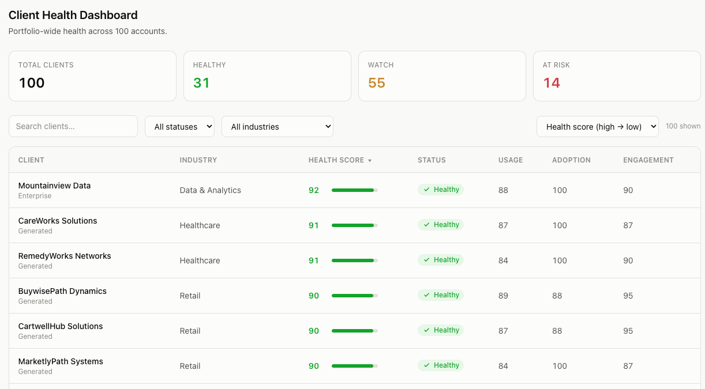

# PulseHQ

**AI-powered client health intelligence platform** — built solo, no engineering background, using Claude Code end to end.

🔗 **Live:** [pulse-hq-eta.vercel.app](https://pulse-hq-eta.vercel.app)
            
## What it does

PulseHQ tracks the health of 100 (fictional) SaaS client accounts and gives a product/client-success team three ways to act on that data:

- **Weekly Strategy** — an AI-generated memo that synthesizes portfolio health against current market news, written fresh each week
- **Client Health Dashboard** — all 100 accounts, sortable and filterable, color-coded healthy / watch / at-risk
- **Adoption Gap Analyzer** — flags which of 8 key features (SSO, Custom Dashboards, Insights, Data Exports, Verbatim Exports, Scheduling, Load Prediction, Mobile App) each client hasn't adopted yet

Each client's health score (0–100) is built from three weighted signals: usage breadth (30%), usage depth (40%), and user reach (30%) — modeled after how I'd actually evaluate account health in a real enterprise SaaS role.

## Why I built it

I've spent years reviewing exactly this kind of dashboard as a product manager, but never built one myself. This was a chance to see the other side: what it actually takes to turn "client health" from a spreadsheet into a live, usable tool — data modeling, AI-generated narrative content, and a UI someone would actually open every week.

## A deliberate product decision

AI-generated content (the weekly strategy memo, gap analysis narratives) is **pre-generated and cached in Supabase** rather than called live on every page load. This was a cost and latency trade-off I made intentionally — most client-health content doesn't need to regenerate on every visit, so caching it keeps the app fast and cheap to run without sacrificing freshness (content refreshes on a schedule, not per-request).

## Tech stack

- **Frontend:** React, Tailwind CSS
- **Backend / data:** Supabase
- **AI:** Claude API
- **Hosting:** Vercel

Mobile-responsive with bottom navigation, and includes a custom OG image for clean link previews when shared.

## Status

Actively maintained side project. Built and iterated on entirely with Claude Code.
